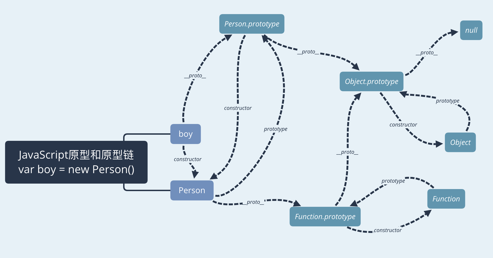

### 原型
原型是一个对象从父级继承来的公共属性。每个对象都有一个内置属性 __proto__ ，指向它继承的原型对象，但不推荐使用

### 原型链
对象继承原型对象，而原型对象继续继承它的原型对象，以此类推形成原型链。每个字面量定义的对象，隐式指定原型是 Object.prototype，所有对象的顶级原型是 null
```
var obj = {};
obj.__proto__ === Object.prototype
Object.prototype.__proto__ === null
```


### 继承
面向对象编程的三大特性：封装、继承、多态
1. 封装：封装就是把抽象的数据和对数据进行的操作封装在一起
2. 继承：对公共的属性和方法复用
3. 多态：在继承的基础上，根据不同的子类实现不同的方法

##### 继承的实现方法
1. 对象继承：Object.create([prototype], { ... });
2. 原型继承：修改 prototype 指向继承
3. 通过 call, apply 方法继承

### jQuery和zepto的原型实现原理
使用插件化机制，只暴露一个全局变量$，并且将开发者的插件放在$.fn中统一管理。
